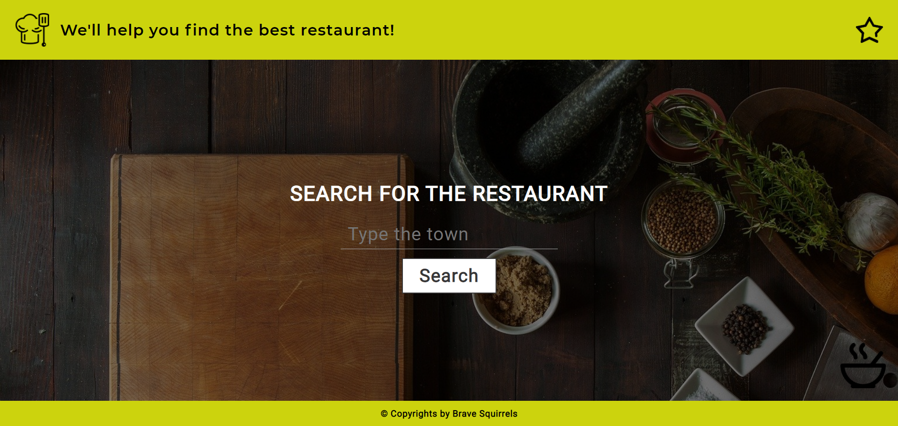
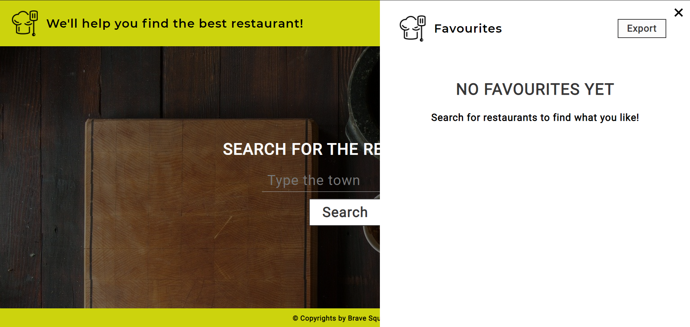
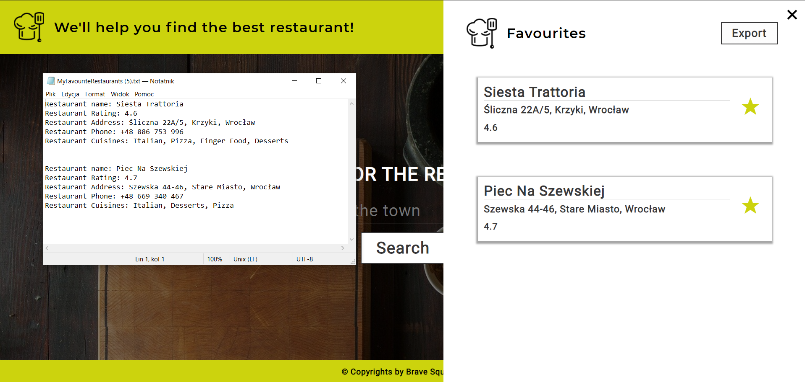

# RestaurantsAPI by BraveSquirrels

### Table of Contents
* [General info](#generalinfo)
* [Technologies](#technologies)
* [Setup](#setup)
* [Walkthrough](#walkthrough)
* [Status](#status)
* [Resources](#resources)

### General Info
Here and today, my dear, you are a witness of something new being created... A **Brave Squirrels Team** first ever project.
We create a Restaurants-API Single-page web app, all you have to do, is type in the name of city you are intrested in, for that You will be rewarded with a list of best restaurants in that city!

*_WARNING_* We can not assure you that your city is going to be avaiable. We are limited by zomato.api, our JSON dealer :)

### Technologies
Project is created with:
* HTML5
* SCSS
* JavaScript
* Node.js
* Node-Fetch

### Setup

### Walkthrough
#### Starting page

#### Restaurants View

#### Single restaurant with reviews View

#### Favourites View

#### Exporting Favourite Restaurants

### Status
The project is finished in 99%... stay tuned! :wink:

### Resources
* https://pixabay.com
* https://pexels.com
* https://www.zomato.com/pl

