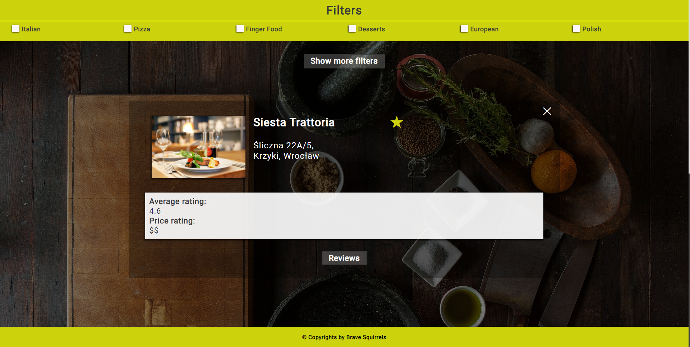

# RestaurantsAPI by BraveSquirrels

### Table of Contents
* [General info](#generalinfo)
* [Technologies](#technologies)
* [Requirements](#requirements)
* [Setup](#setup)
* [Walkthrough](#walkthrough)
* [Status](#status)
* [Resources](#resources)

### General Info
Here and today, my dear, you are a witness of something new being created... A **Brave Squirrels Team** first ever project.
We create a Restaurants-API Single-page web app, all you have to do, is type in the name of city you are intrested in, for that You will be rewarded with a list of best restaurants in that city!

*_WARNING_* We can not assure you that your city is going to be avaiable. We are limited by zomato.api, our JSON dealer :)

### Technologies
Project is created with:
* HTML5
* SCSS
* JavaScript
* Node.js
* Node-Fetch

### Requirements
To be able to run our project, you need to have installed **npm package manager**
If you do not now if you have it installed on your computer nad you still want to run our project follow these steps:

#### Windows command prompt/Linux bash
##### Run *npm -v*
* *If you received a number like 'x.x.x' you already have installed* **npm package manager** *on your computer nad you can follow the [Setup](#setup) guide*
* *Otherwise, you will have to install it, the best way to do it is installing it globaly by running the command **npm install npm@latest -g***
* *After that you can run again the command from the first line just to confirm that you have succesfully installed required* **package manager*

### Setup
To run the project follow these steps:
* *Clone this repository
* *In command prompt run **npm run dev**

### Walkthrough
#### Starting page

#### Restaurants View

#### Single restaurant with reviews View

#### Favourites View

#### Exporting Favourite Restaurants

### Status
The project is now completed!

### Resources
* https://pixabay.com
* https://pexels.com
* https://www.zomato.com/pl

